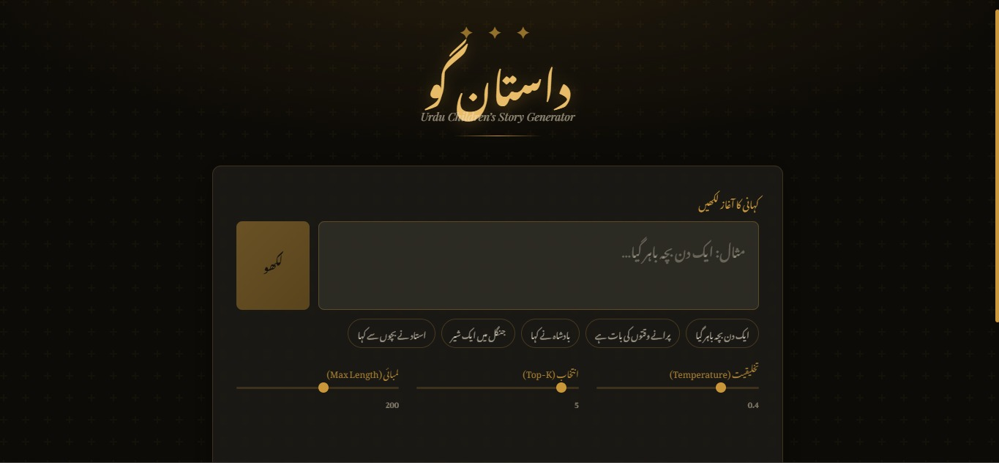
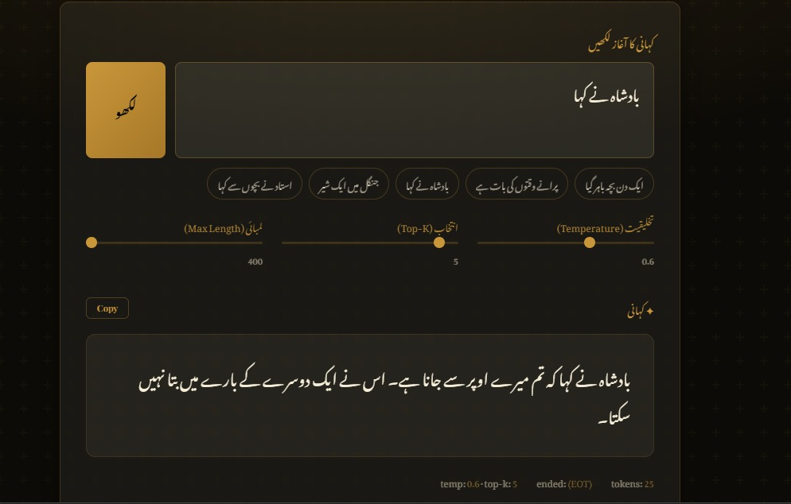
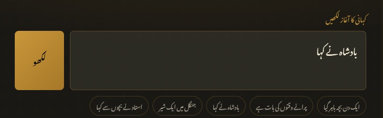
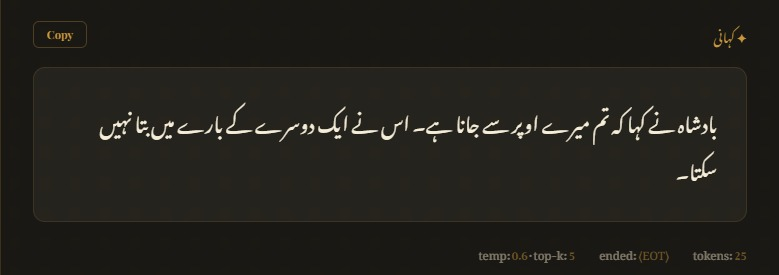

#  Urdu Story Generation AI App  
### Pre-LLM Probabilistic Generative AI System

---

##  Project Overview

This project implements an **Urdu Story Generation AI System for Children**, inspired by **pre-LLM probabilistic language modeling techniques**.

Instead of modern transformer-based models (LLMs), this system is built using:

-  Tri-gram Language Model (N-gram based probability)
-  Custom Byte Pair Encoding (BPE) Tokenizer
-  FastAPI Microservice
-  Docker Containerization
-  Classical Probabilistic Text Generation

This project demonstrates how text generation worked *before* the transformer revolution.

---

##  Architecture Overview

```
Raw Urdu Text Corpus
        ↓
BPE Tokenizer Training
        ↓
Tokenized Corpus
        ↓
Tri-gram Model Training
        ↓
Probability Dictionary
        ↓
FastAPI Story Generator Endpoint
        ↓
Docker Deployment
```

---

##  Project Structure

```
urdu-story-gen-ai/
│
├── app/
│   ├── main.py              # FastAPI app
│   ├── model.py             # Tri-gram model logic
│   ├── tokenizer.py         # Custom BPE tokenizer
│   └── utils.py             # Helper functions
│
├── data/
│   └── urdu_corpus.txt      # Training text corpus
│
├── model/
│   └── trigram_model.pkl    # Saved probability model
│
├── requirements.txt
├── Dockerfile
└── README.md
```

---

##  Installation (Local Setup)


### 1 Create Virtual Environment

```bash
python -m venv venv
source venv/bin/activate      # Linux / Mac
venv\Scripts\activate         # Windows
```

### 2 Install Dependencies

```bash
pip install -r requirements.txt
```

### 3 Run FastAPI Server

```bash
uvicorn app.main:app --reload
```

Open in browser:

```
http://127.0.0.1:8000/docs
```

---

##  Docker Setup

### Build Docker Image

```bash
docker build -t urdu-story-ai .
```

### Run Container

```bash
docker run -p 8000:8000 urdu-story-ai
```

---

##  API Usage

### Generate Story

**Endpoint:**
```
POST /generate
```

**Request Body:**
```json
{
  "prompt": "ایک بہادر لڑکا",
  "max_length": 100
}
```

**Response:**
```json
{
  "story": "ایک بہادر لڑکا جنگل میں گیا..."
}
```
---

#  UI Overview

Below are real screenshots of the application:

## Main Interface

> 

## 📊 Dashboard – Poetry Generator



---

#  Key UI Features

## 1️ Urdu Input Box




- Accepts starting phrase
- Full RTL (Right-to-Left) support
- Placeholder examples for children

**Example Prompt:**

```
بادشاہ نے کہا
```

---

## 2️ Generation Controls


Interactive controls allow fine-tuning story generation.

###  Max Length
Controls maximum number of tokens generated.

###  Top-K Sampling
Limits prediction to top K most probable tokens.

###  Temperature Control
Controls randomness in story generation:

- `0.2` → Deterministic (More predictable)
- `0.6` → Balanced (Recommended)
- `1.0` → Creative (More diverse)

---

## 3️ Story Suggestions

Predefined clickable prompts improve usability for children:

- ایک دن چڑیا اڑی  
- جنگل میں ایک شیر  
- بادشاہ نے کہا  
- استاد نے بچوں سے کہا  

These help young users quickly start generating stories.

---

## 4️ Copy Button

- One-click copy functionality
- Easily reuse generated stories
- Improves classroom usability

---

## 5️ Output Section




Displays:

-  Generated Urdu story  
-  Tokens used  
-  Temperature value  
-  Top-K value  
-  End condition (`<EOT>`)

**Example Footer:**

```
temp:0.6   top-k:5   ended:<EOT>   tokens:25
```

---

## 6️ ChatGPT-like Behavior

- Step-wise token generation
- Smooth real-time story rendering
- Clean Urdu typography
- Gold-on-dark theme for premium aesthetic
- Responsive and minimal design

---

#  Design Philosophy

The UI is designed to:

- Be child-friendly
- Support Urdu RTL layout properly
- Provide educational control over probabilistic text generation
- Mimic modern AI chat interfaces while using classical NLP models

---


##  Model Details

###  Tokenization
- Custom Byte Pair Encoding (BPE)
- Handles Urdu subword segmentation

###  Language Model
- Tri-gram Probability Model
- Maximum Likelihood Estimation (MLE)
- Laplace Smoothing (Optional)

Probability Formula:

\[
P(w_3 | w_1, w_2) = \frac{Count(w_1, w_2, w_3)}{Count(w_1, w_2)}
\]

---

## Features

 Pure probabilistic text generation  
 No external pretrained models  
 Lightweight & fast  
 Educational implementation  
 Docker-ready  
 REST API ready  

---

## Author

Afroz Talha   
Misbah Khan  
Uroosh Kamran  
